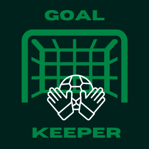
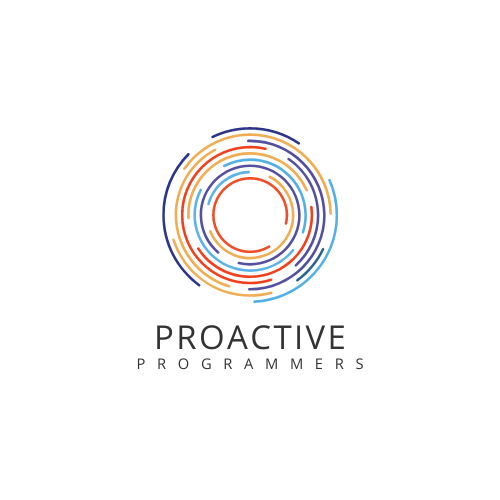

# Goal Keeper

Goal Keeper is the premier application designed to help you achieve your goals. By allowing you to input individual goals and necessary sub-tasks, Goal Keeper makes tracking your progress and managing your time easier than ever. Each subtask can be assigned a priority and due date.

## Features
- **Goal Setting**: Set and manage individual goals. 
- **Subtasks**: Break down your goals into manageable tasks.
- **Login**: User authentication for personalized experience.
- Additional features like user-friendly UI, reminders and more!

## Installation

1. Install Node.js and PostgreSQL on your machine.
2. Clone the repository.
3. Install the dependencies with `npm install`.
4. Run the application with `npm run start`.

## Usage
- Screenshots and gifs demonstrating the usage of the app will go here.

## Roadmap

- Improved authentication.
- Enhanced testing.
- Advanced sorting of tasks.

Stay tuned for these features!

## License

This project is licensed under the MIT license.

## Contact Information

This application is a collaborative effort from the Proactive Programmers Team:

- Ivy Wang
- Shahmar Aliyev
- Mike Bednarz
- Nick Huemmer

For any queries, please feel free to contact us.

